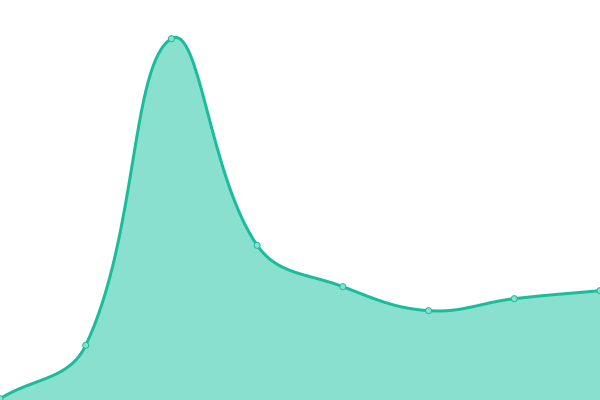
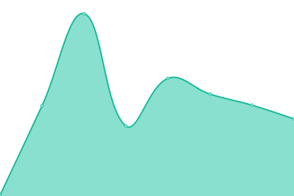
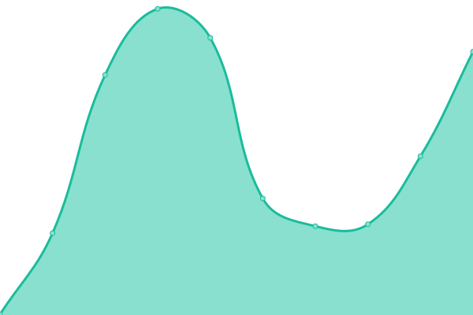

# [📈 Live Status](https://status.ivyfanchiang.ca): <!--live status--> **🟩 All systems operational**

This repository contains the open-source uptime monitor and status page for [Ivy Fan-Chiang](https://ivyfanchiang.ca), powered by [Upptime](https://github.com/upptime/upptime).

With [Upptime](https://upptime.js.org), you can get your own unlimited and free uptime monitor and status page, powered entirely by a GitHub repository. We use [Issues](https://github.com/hexadecimalDinosaur/status.ivyfanchiang.ca/issues) as incident reports, [Actions](https://github.com/hexadecimalDinosaur/status.ivyfanchiang.ca/actions) as uptime monitors, and [Pages](https://status.ivyfanchiang.ca) for the status page.

<!--start: status pages-->
<!-- This summary is generated by Upptime (https://github.com/upptime/upptime) -->
<!-- Do not edit this manually, your changes will be overwritten -->
<!-- prettier-ignore -->
| URL | Status | History | Response Time | Uptime |
| --- | ------ | ------- | ------------- | ------ |
|  [Home: ivyfanchiang.ca](https://ivyfanchiang.ca) | 🟩 Up | [home-ivyfanchiang-ca.yml](https://github.com/hexadecimalDinosaur/status.ivyfanchiang.ca/commits/HEAD/history/home-ivyfanchiang-ca.yml) | 

 137ms
     
 | 

<a href="https://status.ivyfanchiang.ca/history/home-ivyfanchiang-ca">100.00%</a>
    

|  [h5ai: files.ivyfanchiang.ca](https://files.ivyfanchiang.ca) | 🟩 Up | [h5ai-files-ivyfanchiang-ca.yml](https://github.com/hexadecimalDinosaur/status.ivyfanchiang.ca/commits/HEAD/history/h5ai-files-ivyfanchiang-ca.yml) | 

 200ms
     
 | 

<a href="https://status.ivyfanchiang.ca/history/h5ai-files-ivyfanchiang-ca">100.00%</a>
    

|  NextCloud | 🟩 Up | [next-cloud.yml](https://github.com/hexadecimalDinosaur/status.ivyfanchiang.ca/commits/HEAD/history/next-cloud.yml) | 

 731ms
     
 | 

<a href="https://status.ivyfanchiang.ca/history/next-cloud">100.00%</a>
    

|  HedgeDoc | 🟩 Up | [hedge-doc.yml](https://github.com/hexadecimalDinosaur/status.ivyfanchiang.ca/commits/HEAD/history/hedge-doc.yml) | 

 347ms
     
 | 

<a href="https://status.ivyfanchiang.ca/history/hedge-doc">100.00%</a>
    

|  [Shaarli: shaarli.ivyfanchiang.ca](https://shaarli.ivyfanchiang.ca/) | 🟩 Up | [shaarli-shaarli-ivyfanchiang-ca.yml](https://github.com/hexadecimalDinosaur/status.ivyfanchiang.ca/commits/HEAD/history/shaarli-shaarli-ivyfanchiang-ca.yml) | 

 386ms
     
 | 

<a href="https://status.ivyfanchiang.ca/history/shaarli-shaarli-ivyfanchiang-ca">100.00%</a>
    

|  [Akkoma: fedi.underpowe.red](https://fedi.underpowe.red/) | 🟩 Up | [akkoma-fedi-underpowe-red.yml](https://github.com/hexadecimalDinosaur/status.ivyfanchiang.ca/commits/HEAD/history/akkoma-fedi-underpowe-red.yml) | 

 402ms
     
 | 

<a href="https://status.ivyfanchiang.ca/history/akkoma-fedi-underpowe-red">100.00%</a>
    

|  Authentik | 🟩 Up | [authentik.yml](https://github.com/hexadecimalDinosaur/status.ivyfanchiang.ca/commits/HEAD/history/authentik.yml) | 

 710ms
     
 | 

<a href="https://status.ivyfanchiang.ca/history/authentik">75.33%</a>
    

<!--end: status pages-->

[**Visit our status website →**](https://status.ivyfanchiang.ca)

## 📄 License

- Powered by: [Upptime](https://github.com/upptime/upptime)
- Code: [MIT](./LICENSE) © [Ivy Fan-Chiang](https://ivyfanchiang.ca)
- Data in the `./history` directory: [Open Database License](https://opendatacommons.org/licenses/odbl/1-0/)
